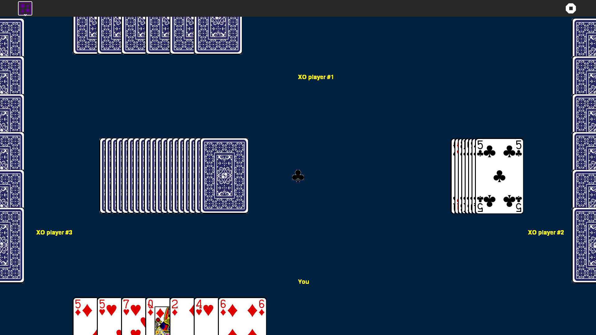

Fifty-two Activity 
===============

FiftyTwo is a set of card games, such as Go Fish, Crazy Eights, Hearts, Solitaire, and maybe eventually games like Eucher or Spades.

How to use?
===============
Fifty-two is not a part of Sugar Desktop but can be added. Refer to the following links-

* [How to Get Sugar on sugarlabs.org](https://sugarlabs.org/), 
* [How to use Sugar](https://help.sugarlabs.org/)

How to upgrade?
===============
On Sugar Desktop systems;

* [Use My Settings,](https://help.sugarlabs.org/my_settings.html) [Software Update](https://help.sugarlabs.org/my_settings.html#software-update) 
* [Use Browse to open ](https://activities.sugarlabs.org/)activities.sugarlabs.org Search for fifty-two, then download
